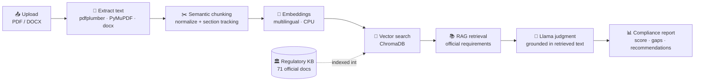
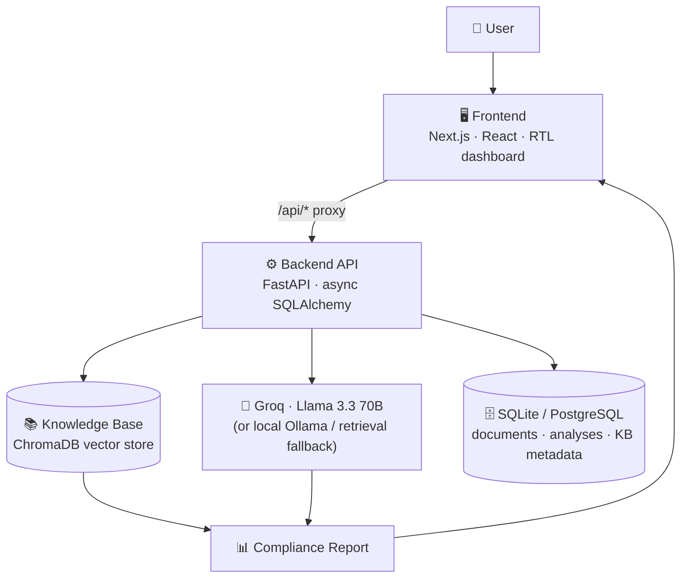

<div align="center">

# واءم · WAAEM

### AI Governance & Compliance Platform

**Evaluate any organizational document against official Saudi regulations — using Retrieval‑Augmented Generation (RAG) and Llama.**

[](#-license)
[](https://nextjs.org/)
[](https://react.dev/)
[](https://www.typescriptlang.org/)
[](https://fastapi.tiangolo.com/)
[](https://www.python.org/)
[](https://www.trychroma.com/)
[](https://groq.com/)
[](https://www.docker.com/)

</div>

---

WAAEM (Arabic: **واءم**, *to align/harmonize*) is an AI‑powered platform that compares any uploaded governance document — a policy, procedure, manual, or internal regulation — against an **official Saudi regulatory knowledge base**, and returns a structured, Arabic‑first compliance report.

It does this with **Retrieval‑Augmented Generation (RAG)**: the platform maintains a live vector index of official regulations published by five Saudi authorities, retrieves the requirements most relevant to your document, and asks **Llama** to judge compliance grounded strictly in the retrieved regulatory text. There are **no hardcoded rules and no manual mappings** — and the model is never allowed to invent regulations that aren't in the knowledge base.

> **A real knowledge base, not a mock.** An ingestion pipeline downloads the actual official PDFs, extracts and chunks them, generates embeddings, and indexes them into a persistent vector database. Any source that cannot be fetched is **reported honestly with a reason** — never fabricated.

---

## 📑 Table of Contents

- [Features](#-features)
- [Supported Regulatory Authorities](#-supported-regulatory-authorities)
- [How It Works](#-how-it-works)
- [System Architecture](#-system-architecture)
- [Technology Stack](#-technology-stack)
- [Project Structure](#-project-structure)
- [Installation](#-installation)
- [Environment Variables](#-environment-variables)
- [Deployment](#-deployment)
- [Knowledge Base](#-knowledge-base)
- [Compliance Report](#-compliance-report)
- [Screenshots](#-screenshots)
- [Security](#-security)
- [Roadmap](#-roadmap)
- [License](#-license)
- [Contributing](#-contributing)
- [Acknowledgements](#-acknowledgements)

---

## ✨ Features

| | Capability | Details |
|---|---|---|
| 📤 | **Document upload** | Upload `PDF` and `DOCX` files (up to 25 MB by default). Analysis begins automatically on upload. |
| 📝 | **Automatic text extraction** | PDFs via **pdfplumber** with a **PyMuPDF** fallback; Word documents via **python‑docx** (including tables). |
| 🔎 | **OCR support** | Scanned regulatory PDFs with no text layer are OCR'd with **Tesseract** (`ara+eng`) during knowledge‑base ingestion. |
| 🤖 | **AI‑powered compliance analysis** | **Llama** judges each retrieved requirement as *Compliant / Partially Compliant / Non‑Compliant / Not Applicable*, with an Arabic justification. |
| 🧠 | **Retrieval‑Augmented Generation (RAG)** | Every judgment is grounded strictly in official regulatory text retrieved from the vector store — the model never invents regulations. |
| 📚 | **Vector search** | Multilingual (Arabic + English) semantic search over **ChromaDB** with cosine similarity and per‑authority coverage. |
| 🏛️ | **Official Saudi regulatory knowledge base** | 71 official source documents across 5 authorities, auto‑ingested from government portals with full provenance. |
| 📊 | **Compliance scoring** | An overall compliance percentage (0–100) plus a per‑authority breakdown and matched/partial/missing/critical totals. |
| 🧾 | **Executive summary** | An auto‑generated Arabic narrative summarizing the overall result and headline numbers. |
| 🕳️ | **Gap analysis** | Per requirement: what is missing, how it's covered, and the associated severity. |
| ✅ | **Recommendations** | Prioritized, deduplicated remediation actions tied to the specific official citation. |
| 📄 | **Evidence from the uploaded document** | Each finding quotes the passage in *your* document that supports (or fails to support) the requirement. |
| ⚖️ | **Evidence from official regulations** | Each finding is tied to the retrieved regulatory requirement, with reference id and source URL. |
| 🏷️ | **Authority‑based breakdown** | Compliance scored and grouped per regulatory authority. |
| 🖥️ | **Responsive enterprise dashboard** | A polished Arabic (RTL) Next.js workspace: animated score ring, KPI tiles, filterable findings, per‑authority drill‑down, and a detail drawer with the official citation. |

### Reliability built in

- **Graceful AI fallback** — if the primary model is unreachable or returns an error, WAAEM falls back to a deterministic, retrieval‑grounded scorer so the analysis never fails outright. It still cites only real retrieved regulations.
- **Honest ingestion** — the downloader respects `robots.txt`, validates that every download is a real PDF, and records failures (WAF/bot protection, HTTP status, broken link, not‑a‑PDF, needs‑OCR) instead of fabricating content.
- **Version history** — when a newer version of a regulation is detected (by file hash), the old version is superseded and re‑indexed while history is preserved.

---

## 🏛️ Supported Regulatory Authorities

WAAEM ships with a reference knowledge base covering **71 official documents** across **five Saudi regulatory authorities**:

| Authority | الجهة | Registered documents | Example scope |
|---|---|:--:|---|
| **DGA** — Digital Government Authority | هيئة الحكومة الرقمية | 18 | Digital Government Regulatory Framework, Digital Government Policies, IT Governance & Enterprise Architecture controls |
| **NCA** — National Cybersecurity Authority | الهيئة الوطنية للأمن السيبراني | 27 | Essential (ECC), Cloud (CCC), Critical Systems (CSCC), OT (OTCC), Data (DCC) & Telework (TCC) Cybersecurity Controls |
| **NDMO** — National Data Management Office | مكتب إدارة البيانات الوطنية | 12 | National Data Governance policies, data classification/sharing, open data, AI ethics principles |
| **PDPL** — Personal Data Protection Law | نظام حماية البيانات الشخصية | 6 | The Law, its Implementing Regulation, and the cross‑border data transfer regulation |
| **CST** — Communications, Space & Technology Commission | هيئة الاتصالات والفضاء والتقنية | 8 | Cybersecurity Regulatory Framework, cloud provisioning, personal‑data principles, IoT regulations |

> **Modular by design.** Adding a new authority or document requires **only** adding an entry to [`backend/app/kb/sources.py`](backend/app/kb/sources.py) — or pointing `KB_SOURCES_FILE` at an external JSON list — with **no application‑logic changes**. On the next ingestion run the new sources are downloaded, chunked, embedded, and indexed automatically.

---

## ⚙️ How It Works

The complete pipeline, from a raw upload to a finished report:

1. **Upload document** — the user uploads a `PDF` or `DOCX`; the backend validates the type and size.
2. **Text extraction** — text is extracted (pdfplumber → PyMuPDF fallback, or python‑docx).
3. **Document chunking** — the text is normalized and split into paragraph‑aware, section‑tracked semantic chunks with overlap.
4. **Embedding generation** — each chunk is embedded with a multilingual (Arabic + English) model.
5. **Retrieval from ChromaDB** — the chunk vectors query the vector store of official regulations.
6. **RAG retrieves the relevant regulatory requirements** — the best‑matching official controls are selected, with per‑authority coverage and full provenance.
7. **Llama evaluates compliance** — the model judges each retrieved requirement against the uploaded document and produces an Arabic verdict + evidence.
8. **Compliance report generation** — the backend aggregates scores per authority, computes totals, writes an executive summary, and returns a validated report to the dashboard.



> If Llama is unavailable or errors out, step 7 is replaced by a deterministic **retrieval‑grounded scorer** that assigns compliance status from semantic‑similarity thresholds — using the exact same retrieved requirements, so the report is always produced and always cited.

---

## 🧭 System Architecture

WAAEM is a two‑tier application. The Next.js frontend proxies `/api/*` to the FastAPI backend, so the entire app can be served from a single origin. The backend owns the RAG engine, the vector store, and all AI calls — **the browser never talks to Llama directly.**



**Request flow for an analysis**

```
User → Frontend (Next.js) → Backend API (FastAPI)
     → Knowledge Base (ChromaDB retrieval)
     → Groq (Llama 3.3 70B) judgment
     → Compliance Report → back to the dashboard
```

**Backend startup** initializes the database, then (non‑blocking) auto‑builds the knowledge base if the vector store is empty, warms the model, and starts the optional periodic KB auto‑update loop.

### REST API

| Method | Endpoint | Description |
|---|---|---|
| `GET` | `/api/health` | Liveness check + current KB chunk count |
| `GET` | `/api/ai/status` | AI engine, model, online state, embedding model |
| `POST` | `/api/upload` | Validate, extract, and store uploaded documents |
| `POST` | `/api/analyze` | Run the RAG compliance analysis → returns `analysis_id` |
| `GET` | `/api/result/{id}` | Full compliance report payload |
| `GET` | `/api/report/{id}` | Flat, export‑friendly executive report |
| `GET` | `/api/history` | Recent analyses |
| `GET` | `/api/kb/status` | KB chunks, indexed documents (with provenance), and honest ingestion failures |
| `POST` | `/api/kb/ingest?force=` | Run the ingestion pipeline against all registered sources |

Interactive API docs are available at `/docs` (Swagger UI) when the backend is running.

---

## 🛠️ Technology Stack

**Frontend**
- [Next.js 16](https://nextjs.org/) (App Router, standalone output, Turbopack dev)
- [React 19](https://react.dev/) + [TypeScript 5](https://www.typescriptlang.org/)
- [Tailwind CSS 4](https://tailwindcss.com/) (via `@tailwindcss/postcss`)
- [Framer Motion](https://www.framer.com/motion/), [Recharts](https://recharts.org/), [lucide‑react](https://lucide.dev/) icons
- [TanStack Query](https://tanstack.com/query) for data fetching

**Backend**
- [FastAPI 0.115](https://fastapi.tiangolo.com/) + [Uvicorn](https://www.uvicorn.org/) (ASGI)
- [Python 3.12](https://www.python.org/)
- [SQLAlchemy 2.0](https://www.sqlalchemy.org/) (async) + [Alembic](https://alembic.sqlalchemy.org/) migrations
- [Pydantic 2](https://docs.pydantic.dev/) + `pydantic‑settings`
- [aiosqlite](https://aiosqlite.omnilib.dev/) (local dev) / [asyncpg](https://magicstack.github.io/asyncpg/) + PostgreSQL (production)

**RAG & document processing**
- [ChromaDB](https://www.trychroma.com/) — persistent vector store (cosine similarity)
- [fastembed](https://github.com/qdrant/fastembed) — multilingual ONNX embeddings (`paraphrase-multilingual-MiniLM-L12-v2`, 384‑dim, CPU)
- [pdfplumber](https://github.com/jsvine/pdfplumber) + [PyMuPDF](https://pymupdf.readthedocs.io/) + [python‑docx](https://python-docx.readthedocs.io/) — text extraction
- [pytesseract](https://github.com/madmaze/pytesseract) + Tesseract OCR (`ara+eng`) — scanned‑PDF fallback
- [BeautifulSoup4](https://www.crummy.com/software/BeautifulSoup/) + [httpx](https://www.python-httpx.org/) — robots‑aware document downloader

**AI (Llama)**
- [Groq](https://groq.com/) hosted Llama (`llama-3.3-70b-versatile`, OpenAI‑compatible) — primary when `GROQ_API_KEY` is set
- [Ollama](https://ollama.com/) local Llama — used when no Groq key is configured
- Optional [llama.cpp](https://github.com/ggerganov/llama.cpp) OpenAI‑compatible endpoint fallback
- Deterministic retrieval‑grounded scorer — final fallback (never invents regulations)

**Infrastructure & deployment**
- [Docker](https://www.docker.com/) + [Docker Compose](https://docs.docker.com/compose/) (full stack: PostgreSQL + Ollama + backend + frontend)
- [Vercel](https://vercel.com/) (`vercel.json`, frontend) and [Render](https://render.com/) (`render.yaml`, backend) configs included

---

## 📁 Project Structure

```
WAAEM/
├── backend/                     # FastAPI RAG compliance engine
│   ├── app/
│   │   ├── main.py              # App factory, lifespan, health & AI-status routes
│   │   ├── core/               # Settings, logging, error handling
│   │   ├── db/                 # Async engine, session factory, ORM models
│   │   ├── routers/            # upload · analyze · result · kb endpoints
│   │   ├── schemas/            # Pydantic request/response & report contracts
│   │   ├── services/           # Compliance engine, Llama client, extraction, orchestration
│   │   │   ├── compliance.py   #   RAG retrieval + Llama/retrieval scoring
│   │   │   ├── llama.py        #   Groq / Ollama / llama.cpp client (validated JSON)
│   │   │   ├── extraction.py   #   PDF & DOCX text extraction
│   │   │   └── analysis_service.py
│   │   ├── kb/                 # Knowledge-base pipeline
│   │   │   ├── sources.py      #   Official source registry (5 authorities · 71 docs)
│   │   │   ├── downloader.py   #   Robots-aware, honest-failure downloader
│   │   │   ├── ingest.py       #   download → extract(+OCR) → chunk → embed → index
│   │   │   ├── chunking.py     #   Normalize + semantic chunking
│   │   │   ├── embeddings.py   #   fastembed multilingual embeddings
│   │   │   ├── vectorstore.py  #   ChromaDB persistent collection
│   │   │   ├── ocr.py          #   Tesseract OCR for scanned PDFs
│   │   │   └── updater.py      #   Auto-build + periodic re-check
│   │   └── repositories/       # Data-access layer
│   ├── alembic/                # Database migrations
│   ├── knowledge_base/         # Downloaded PDFs + ChromaDB store (generated)
│   ├── requirements.txt
│   └── Dockerfile
│
├── frontend/                    # Next.js dashboard (Arabic / RTL)
│   ├── src/
│   │   ├── app/                # App Router: layout, page, global styles
│   │   ├── components/         # WAAEM UI (landing, report, dashboard) + primitives
│   │   └── lib/                # API client, types, utils
│   ├── package.json
│   ├── next.config.ts          # /api/* → backend proxy (rewrites)
│   ├── Dockerfile
│   └── vercel.json
│
├── docker-compose.yml           # Full stack: Postgres + Ollama + backend + frontend
├── render.yaml                  # Render blueprint (backend + Postgres)
├── start.sh                     # One-command local dev (backend + frontend)
├── DEPLOYMENT.md
└── RENDER_DEPLOY.md
```

---

## 🚀 Installation

### Prerequisites

- **Node.js 20+** and **npm**
- **Python 3.12+**
- **Tesseract OCR** *(optional)* — only needed to OCR scanned regulatory PDFs during ingestion. Install `tesseract-ocr`, `tesseract-ocr-ara`, `tesseract-ocr-eng`.
- **Ollama** *(optional)* — only if you want local Llama inference instead of hosted Groq.
- Internet access on first run — the ingestion pipeline downloads the official regulation PDFs and the embedding model downloads once.

### 1. Clone the repository

```bash
git clone <your-repo-url> WAAEM
cd WAAEM
```

### 2. Quick start (both services)

The included script creates the Python virtualenv, installs dependencies, runs migrations, and starts both services:

```bash
./start.sh
# backend  → http://127.0.0.1:8000
# frontend → http://127.0.0.1:3000
```

### 3. Manual setup

<details>
<summary><b>Backend (FastAPI)</b></summary>

```bash
cd backend
python3 -m venv venv && source venv/bin/activate
pip install -r requirements.txt
cp .env.example .env            # then edit as needed (see Environment Variables)
alembic upgrade head
python -m uvicorn app.main:app --reload --port 8000
```

On first start the backend **auto‑ingests** the official Saudi regulations into ChromaDB. You can also trigger and inspect ingestion manually:

```bash
curl -X POST http://localhost:8000/api/kb/ingest
curl http://localhost:8000/api/kb/status
```
</details>

<details>
<summary><b>Frontend (Next.js)</b></summary>

```bash
cd frontend
npm install
cp .env.example .env.local      # BACKEND_URL defaults to http://127.0.0.1:8000
npm run dev                     # http://localhost:3000
```
</details>

<details>
<summary><b>Enable local Llama (optional)</b></summary>

Leave `GROQ_API_KEY` empty to use a local model via Ollama:

```bash
ollama pull llama3.1            # backend reads OLLAMA_HOST (default http://localhost:11434)
```

Without any model configured, the deterministic retrieval‑grounded scorer runs — still citing only real retrieved regulations.
</details>

### 4. Docker (single service)

Both `backend/` and `frontend/` ship production `Dockerfile`s. To build and run them individually:

```bash
docker build -t waaem-backend ./backend
docker build -t waaem-frontend ./frontend
```

### 5. Docker Compose (full stack)

Brings up PostgreSQL, Ollama, the backend, and the frontend together. The knowledge base auto‑ingests on first boot.

```bash
docker compose up --build
docker compose exec ollama ollama pull llama3.1   # pull the local model once
# frontend → http://localhost:3000
# backend  → http://localhost:8000
```

---

## 🔐 Environment Variables

### Backend (`backend/.env`)

| Variable | Default | Description |
|---|---|---|
| `ENVIRONMENT` | `development` | Runtime environment name |
| `LOG_LEVEL` | `INFO` | Logging verbosity |
| `CORS_ORIGINS` | `*` | Comma‑separated allowed origins |
| `DATABASE_URL` | `sqlite+aiosqlite:///./waaem.db` | Async DB URL. Managed `postgres://` URLs are auto‑normalized to `asyncpg` |
| `UPLOAD_DIR` | `./uploads` | Where raw uploaded files are stored |
| `MAX_UPLOAD_MB` | `25` | Maximum upload size per file |
| `ALLOWED_EXTENSIONS` | `pdf,docx` | Accepted upload file types |
| `KB_DIR` | `./knowledge_base` | Knowledge‑base working directory |
| `CHROMA_DIR` | `./knowledge_base/chroma` | ChromaDB persistence path |
| `KB_COLLECTION` | `saudi_regulations` | Chroma collection name |
| `EMBED_MODEL` | `sentence-transformers/paraphrase-multilingual-MiniLM-L12-v2` | Multilingual embedding model |
| `RETRIEVAL_TOP_K` | `8` | Retrieval breadth |
| `KB_AUTO_BUILD` | `true` | Auto‑ingest official sources on first startup when the store is empty |
| `KB_UPDATE_INTERVAL_HOURS` | `0` | Periodic KB re‑check interval in hours (`0` disables; e.g. `168` = weekly) |
| `KB_SOURCES_FILE` | *(unset)* | Optional JSON file of extra sources to add without code changes |
| `RESPECT_ROBOTS` | `true` | Honor `robots.txt` during ingestion |
| `OLLAMA_HOST` | `http://localhost:11434` | Local Ollama endpoint |
| `LLAMA_MODEL` | `llama3.1` | Local Llama model name |
| `LLAMA_TIMEOUT` | `120` | Local inference timeout (seconds) |
| `LLAMA_MAX_RETRIES` | `2` | Retries for model output validation |
| `AI_ALLOW_FALLBACK` | `true` | Fall back to the retrieval‑grounded scorer if the model fails |
| `LLAMACPP_URL` | *(unset)* | Optional llama.cpp OpenAI‑compatible endpoint |
| `GROQ_API_KEY` | *(unset)* | **When set, WAAEM uses hosted Groq Llama as the primary engine** |
| `GROQ_BASE_URL` | `https://api.groq.com/openai/v1` | Groq OpenAI‑compatible base URL |
| `GROQ_MODEL` | `llama-3.3-70b-versatile` | Hosted Llama model |
| `GROQ_TIMEOUT` | `60` | Groq request timeout (seconds) |

### Frontend (`frontend/.env.local`)

| Variable | Default | Description |
|---|---|---|
| `BACKEND_URL` | `http://127.0.0.1:8000` | Server‑side proxy target for `/api/*` (see `next.config.ts`) |
| `NEXT_PUBLIC_API_URL` | *(empty)* | Set only to make the **browser** call a remote API directly instead of using the same‑origin proxy |

> 🔑 **Never commit real secrets.** `GROQ_API_KEY` and any production `DATABASE_URL` should live only in your local `.env` (git‑ignored) or your host's secret manager.

---

## ☁️ Deployment

The frontend deploys to **Vercel**; the backend runs on any Docker host (with a managed PostgreSQL). The frontend proxies `/api/*` to the backend, so the browser only ever talks to one origin.

### Vercel (recommended — frontend)

1. Import the repo at [vercel.com/new](https://vercel.com/new) and set **Root Directory** to `frontend` (Next.js preset auto-detected).
2. Add an environment variable **`BACKEND_URL`** = your backend's public URL (e.g. `https://waaem-backend.onrender.com`).
3. Deploy. Next.js rewrites `/api/*` to `BACKEND_URL` server-side, so there are **no CORS issues** and the API base never changes.

> Vercel hosts the Next.js frontend only. The FastAPI backend needs a long-running process, a persistent disk for ChromaDB, and Tesseract OCR — so it runs on a container host, not Vercel serverless.

### Backend (Render / Docker)

The `render.yaml` blueprint provisions the backend (Docker web service) plus a managed PostgreSQL database:

- **Backend** runs `alembic upgrade head && uvicorn app.main:app --host 0.0.0.0 --port $PORT`, with a health check on `/api/health`; `DATABASE_URL` is auto-linked and normalised to `asyncpg`.
- Copy the backend's public URL into Vercel's `BACKEND_URL`.

See **[DEPLOYMENT.md](DEPLOYMENT.md)** for the full walkthrough.

### Docker Compose (self‑hosted full stack)

```bash
docker compose up --build
```

This runs PostgreSQL, Ollama, the backend, and the frontend, with named volumes for `pgdata`, `ollama`, `uploads`, and `knowledge_base`.

### 💾 Persistent storage for ChromaDB

The vector store is the **source of truth for retrieval** and must persist across restarts and redeploys. Mount a **persistent volume** at `CHROMA_DIR` (default `./knowledge_base/chroma`):

- **Docker Compose** already mounts the `knowledge_base` named volume at `/app/knowledge_base`.
- On **Render**, attach a persistent disk to the backend at the same path.

If the store is empty on boot and `KB_AUTO_BUILD=true`, WAAEM re‑ingests the official sources automatically — but a persistent volume avoids re‑downloading and re‑embedding on every deploy.

---

## 📚 Knowledge Base

The regulatory knowledge base is what makes WAAEM's analysis grounded rather than hallucinated. It is built by an ingestion pipeline that turns official government PDFs into a searchable, fully‑cited vector index.

**Ingestion pipeline** (`backend/app/kb/`):

1. **Official PDF ingestion** — for each entry in the source registry, the robots‑aware downloader fetches the official PDF, following redirects with realistic browser headers and validating that the response is a genuine PDF (not a WAF challenge page).
2. **Extraction (+ OCR)** — text is extracted from the PDF; if a document has no text layer, it is OCR'd with Tesseract (`ara+eng`). Documents that can't be extracted are recorded as `needs_ocr` rather than faked.
3. **Chunking** — text is normalized (diacritics/tatweel stripped, page noise removed) and split into paragraph‑aware semantic chunks with section tracking and overlap.
4. **Embeddings** — each chunk is embedded with a multilingual model that handles both Arabic and English.
5. **ChromaDB** — chunks are upserted into a persistent Chroma collection with full provenance metadata: authority, document title (AR/EN), version, publication date, section, paragraph, reference id, source URL, and language.
6. **Automatic retrieval** — at analysis time, the uploaded document's chunks query this store; the highest‑scoring official requirements (with per‑authority coverage) become the RAG context for the compliance judgment.

The KB **auto‑builds on first startup** when empty, and can **auto‑update** on a configurable interval — detecting new versions by file hash, superseding old ones, and preserving version history. Every run produces an honest report of successes, skips, and failures, surfaced via `GET /api/kb/status`.

---

## 📊 Compliance Report

Each analysis returns a structured, validated report. In the dashboard it renders as an animated score ring, KPI tiles, filterable findings, and a per‑authority breakdown.

| Section | What it contains |
|---|---|
| **Compliance Score** | An overall compliance percentage (0–100), computed as the mean of per‑authority scores. |
| **Executive Summary** | An auto‑generated Arabic narrative stating the overall score, the number of requirements evaluated, per‑authority scores, and matched/partial/missing/critical counts. |
| **Findings** | Per requirement: title, authority, source document, section, **status** (Compliant / Partially Compliant / Non‑Compliant / Not Applicable), rationale, severity, and semantic match score. |
| **Gap Analysis** | For each non‑compliant or partial requirement: what is missing or under‑specified, and the associated severity (NCA gaps are escalated to *critical*). |
| **Recommendations** | Prioritized, deduplicated remediation actions, each tied to the specific official citation to align with. |
| **Authority Breakdown** | Per‑authority score, matched count, and total — so you can see exactly where you stand with DGA, NCA, NDMO, PDPL, and CST. |
| **Source References** | Every finding carries evidence from *your* document, evidence from the regulation, a reference id, and a clickable official source URL. |

> When a requirement has no supporting evidence in the uploaded document, the finding says so explicitly (*"insufficient evidence"*) rather than guessing. Every statement traces back to a retrieved official chunk.

---

## 🖼️ Screenshots

> _Add screenshots / GIFs here._

| | |
|---|---|
| **Landing page** | _`docs/screenshots/landing.png`_ |
| **Upload** | _`docs/screenshots/upload.png`_ |
| **Analysis (in progress)** | _`docs/screenshots/analysis.png`_ |
| **Compliance report** | _`docs/screenshots/report.png`_ |
| **Dashboard** | _`docs/screenshots/dashboard.png`_ |

---

## 🔒 Security

- **API keys** — the Groq API key (and any model/DB credentials) are read from environment variables and used **only** by the backend. The frontend never receives or transmits AI credentials; the browser talks only to the same‑origin `/api/*` proxy.
- **Environment variables** — all secrets live in `.env` files that are git‑ignored, or in your host's secret manager. Rotate any key that is ever exposed.
- **HTTPS** — run behind HTTPS in production. Managed hosts (Render, Vercel) terminate TLS automatically; for self‑hosted Compose, place a TLS‑terminating reverse proxy in front.
- **File upload limits** — uploads are restricted by type (`ALLOWED_EXTENSIONS`, default `pdf,docx`) and size (`MAX_UPLOAD_MB`, default 25 MB). Empty and unsupported files are rejected with clear errors.
- **Data privacy** — uploaded documents are processed by your own backend and stored in your own database and upload directory. When `GROQ_API_KEY` is set, the extracted text and retrieved regulatory context are sent to Groq for the compliance judgment; for a fully self‑hosted, no‑third‑party path, use local Ollama or the retrieval‑grounded scorer instead. Scope `CORS_ORIGINS` to your real frontend origin(s) in production rather than `*`.

---

## 🗺️ Roadmap

Planned enhancements — contributions welcome:

- [ ] **Additional standards & authorities** — ISO 27001, ISO 9001, SAMA, MHRSD, and further Saudi regulations (drop‑in via the source registry)
- [ ] **User accounts** — authentication, roles, and per‑tenant history
- [ ] **Multi‑language support** — an English UI alongside the current Arabic (RTL) experience
- [ ] **Scheduled compliance monitoring** — automated, recurring analyses
- [ ] **Continuous compliance** — track compliance drift over time and alert on regressions
- [ ] **Report export** — polished PDF/Docx export of the compliance report

---

## 📄 License

_License to be determined._ Add your chosen license here (e.g. MIT, Apache‑2.0) and include a corresponding `LICENSE` file.

---

## 🤝 Contributing

Contributions are welcome! To propose a change:

1. **Fork** the repository and create a feature branch: `git checkout -b feature/your-feature`.
2. **Set up** the backend and frontend locally (see [Installation](#-installation)).
3. **Make focused changes** and keep the code style consistent with the surrounding code.
4. **Test your changes** end‑to‑end — verify upload → analyze → report still works, and run the backend health check (`GET /api/health`).
5. **Adding a regulatory source?** Add it to [`backend/app/kb/sources.py`](backend/app/kb/sources.py) (or a `KB_SOURCES_FILE` JSON) with an official, directly‑downloadable URL and complete provenance — no application‑logic changes required. Re‑run ingestion and confirm it indexes cleanly via `GET /api/kb/status`.
6. **Commit** with clear messages, **push**, and open a **Pull Request** describing the change and its motivation.

Please open an issue first for large or architectural changes so we can align on the approach.

---

## 🙏 Acknowledgements

WAAEM is built on top of the **publicly available official regulations** published by Saudi regulatory authorities, used here strictly as reference material for compliance analysis. With gratitude to:

- **Digital Government Authority (DGA)** — هيئة الحكومة الرقمية
- **National Cybersecurity Authority (NCA)** — الهيئة الوطنية للأمن السيبراني
- **National Data Management Office (NDMO) / SDAIA** — مكتب إدارة البيانات الوطنية
- **Personal Data Protection Law (PDPL) / SDAIA** — نظام حماية البيانات الشخصية
- **Communications, Space & Technology Commission (CST)** — هيئة الاتصالات والفضاء والتقنية

All regulatory documents remain the property of their respective authorities. WAAEM does not redistribute or alter these documents; it retrieves and cites them to support compliance evaluation.

<div align="center">

---

**واءم · WAAEM** — aligning organizations with Saudi regulations, intelligently.

</div>
